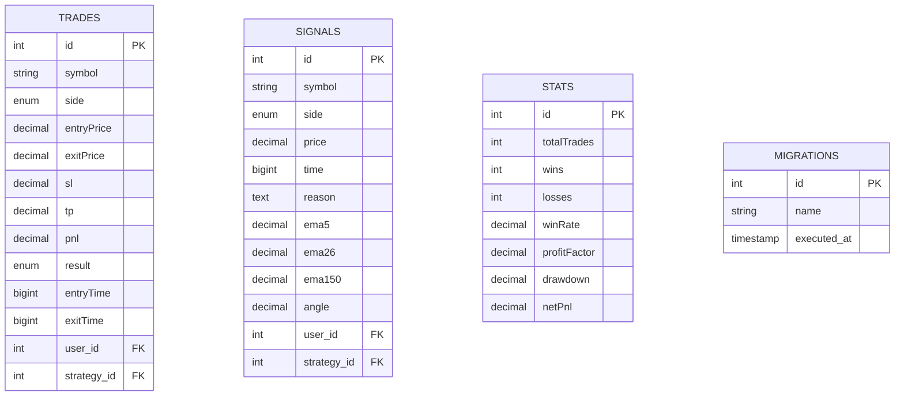
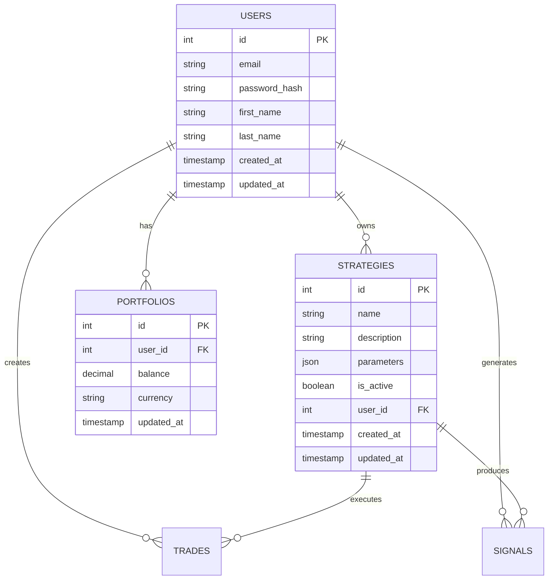

# Database Design

## Overview

The Trade EMA system uses MySQL as its primary database for storing trading data, user information, and system analytics. The database schema is designed to support high-frequency trading data while maintaining referential integrity and performance.

## Database Schema

### Core Tables

#### 1. Trades Table

**Purpose**: Store all trade executions and positions

```sql
CREATE TABLE trades (
    id INT AUTO_INCREMENT PRIMARY KEY,
    symbol VARCHAR(10) NOT NULL,
    side ENUM('BUY', 'SELL') NOT NULL,
    entryPrice DECIMAL(10, 2) NOT NULL,
    exitPrice DECIMAL(10, 2),
    sl DECIMAL(10, 2) NOT NULL,
    tp DECIMAL(10, 2) NOT NULL,
    pnl DECIMAL(10, 2),
    result ENUM('WIN', 'LOSS', 'OPEN') DEFAULT 'OPEN',
    entryTime BIGINT NOT NULL,
    exitTime BIGINT,
    user_id INT,
    strategy_id INT
);
```

**Field Descriptions**:
- `id`: Unique trade identifier
- `symbol`: Trading pair (e.g., 'BTCUSDT')
- `side`: Trade direction (BUY/SELL)
- `entryPrice`: Price at which position was opened
- `exitPrice`: Price at which position was closed
- `sl`: Stop-loss price level
- `tp`: Take-profit price level
- `pnl`: Profit/Loss amount
- `result`: Trade outcome (WIN/LOSS/OPEN)
- `entryTime`: Unix timestamp of position opening
- `exitTime`: Unix timestamp of position closing
- `user_id`: Associated user (future multi-user support)
- `strategy_id`: Strategy that generated the trade

#### 2. Signals Table

**Purpose**: Store all trading signals generated by strategies

```sql
CREATE TABLE signals (
    id INT AUTO_INCREMENT PRIMARY KEY,
    symbol VARCHAR(10) NOT NULL,
    side ENUM('BUY', 'SELL') NOT NULL,
    price DECIMAL(10, 2) NOT NULL,
    time BIGINT NOT NULL,
    reason TEXT,
    ema5 DECIMAL(10, 2),
    ema26 DECIMAL(10, 2),
    ema150 DECIMAL(10, 2),
    angle DECIMAL(10, 2),
    user_id INT,
    strategy_id INT
);
```

**Field Descriptions**:
- `id`: Unique signal identifier
- `symbol`: Trading pair for the signal
- `side`: Signal direction (BUY/SELL)
- `price`: Price when signal was generated
- `time`: Unix timestamp of signal generation
- `reason`: Human-readable explanation
- `ema5`, `ema26`, `ema150`: EMA values at signal time
- `angle`: Price angle/momentum indicator
- `user_id`: Associated user
- `strategy_id`: Strategy that generated the signal

#### 3. Stats Table

**Purpose**: Store aggregated trading performance statistics

```sql
CREATE TABLE stats (
    id INT AUTO_INCREMENT PRIMARY KEY,
    totalTrades INT DEFAULT 0,
    wins INT DEFAULT 0,
    losses INT DEFAULT 0,
    winRate DECIMAL(5, 2) DEFAULT 0,
    profitFactor DECIMAL(5, 2) DEFAULT 0,
    drawdown DECIMAL(5, 2) DEFAULT 0,
    netPnl DECIMAL(10, 2) DEFAULT 0
);
```

**Field Descriptions**:
- `id`: Record identifier (typically 1 for global stats)
- `totalTrades`: Total number of completed trades
- `wins`: Number of profitable trades
- `losses`: Number of losing trades
- `winRate`: Percentage of winning trades
- `profitFactor`: Ratio of total profits to total losses
- `drawdown`: Maximum percentage decline from peak
- `netPnl`: Total profit/loss amount

#### 4. Migrations Table

**Purpose**: Track database schema changes and migrations

```sql
CREATE TABLE migrations (
    id INT AUTO_INCREMENT PRIMARY KEY,
    name VARCHAR(255) NOT NULL,
    executed_at TIMESTAMP DEFAULT CURRENT_TIMESTAMP
);
```

## Entity Relationships

### Current Relationships



### Future Relationships (Planned)



## Data Types and Constraints

### Decimal Precision

All financial amounts use `DECIMAL(10, 2)` to ensure:
- **Precision**: Exact decimal representation
- **Scale**: 2 decimal places for currency amounts
- **Range**: Up to 99,999,999.99

### Timestamp Storage

- **Unix Timestamps**: Stored as `BIGINT` for precise point-in-time records
- **Creation Times**: Use `TIMESTAMP` with automatic defaults for audit trails

### Enumerated Values

```sql
-- Trade Sides
ENUM('BUY', 'SELL')

-- Trade Results
ENUM('WIN', 'LOSS', 'OPEN')
```

## Indexing Strategy

### Performance Indexes

```sql
-- Trades table indexes
CREATE INDEX idx_trades_symbol_time ON trades(symbol, entryTime);
CREATE INDEX idx_trades_result ON trades(result);
CREATE INDEX idx_trades_user_id ON trades(user_id);
CREATE INDEX idx_trades_strategy_id ON trades(strategy_id);

-- Signals table indexes
CREATE INDEX idx_signals_symbol_time ON signals(symbol, time);
CREATE INDEX idx_signals_side ON signals(side);
CREATE INDEX idx_signals_user_id ON signals(user_id);
CREATE INDEX idx_signals_strategy_id ON signals(strategy_id);

-- Compound indexes for common queries
CREATE INDEX idx_trades_symbol_result_time ON trades(symbol, result, entryTime);
CREATE INDEX idx_signals_symbol_side_time ON signals(symbol, side, time);
```

### Index Rationale

1. **Time-based queries**: Most queries filter by time ranges
2. **Symbol filtering**: Trading data often filtered by symbol
3. **Status filtering**: Filtering by trade results and open positions
4. **User/Strategy filtering**: Multi-tenant support preparation

## Query Patterns

### Common Read Patterns

#### 1. Recent Trades Query
```sql
SELECT * FROM trades 
WHERE symbol = ? 
    AND entryTime >= ? 
ORDER BY entryTime DESC 
LIMIT 50;
```

#### 2. Performance Statistics Query
```sql
SELECT 
    COUNT(*) as totalTrades,
    SUM(CASE WHEN result = 'WIN' THEN 1 ELSE 0 END) as wins,
    SUM(CASE WHEN result = 'LOSS' THEN 1 ELSE 0 END) as losses,
    SUM(pnl) as netPnl,
    AVG(CASE WHEN result = 'WIN' THEN pnl END) as avgWin,
    AVG(CASE WHEN result = 'LOSS' THEN pnl END) as avgLoss
FROM trades 
WHERE result IN ('WIN', 'LOSS');
```

#### 3. Open Positions Query
```sql
SELECT * FROM trades 
WHERE result = 'OPEN' 
ORDER BY entryTime DESC;
```

#### 4. Signal History Query
```sql
SELECT * FROM signals 
WHERE symbol = ? 
    AND time >= ? 
ORDER BY time DESC 
LIMIT 100;
```

### Write Patterns

#### 1. Insert New Trade
```sql
INSERT INTO trades (
    symbol, side, entryPrice, sl, tp, entryTime, user_id, strategy_id
) VALUES (?, ?, ?, ?, ?, ?, ?, ?);
```

#### 2. Update Trade on Close
```sql
UPDATE trades 
SET exitPrice = ?, pnl = ?, result = ?, exitTime = ? 
WHERE id = ?;
```

#### 3. Insert Signal
```sql
INSERT INTO signals (
    symbol, side, price, time, reason, ema5, ema26, ema150, angle, user_id, strategy_id
) VALUES (?, ?, ?, ?, ?, ?, ?, ?, ?, ?, ?);
```

## Data Integrity

### Constraints and Validations

#### 1. Business Rules
- `entryPrice` must be greater than 0
- `sl` (stop-loss) must be different from `entryPrice`
- `tp` (take-profit) must be different from `entryPrice`
- For BUY trades: `sl < entryPrice < tp`
- For SELL trades: `tp < entryPrice < sl`

#### 2. Referential Integrity
```sql
-- Future foreign key constraints
ALTER TABLE trades 
ADD CONSTRAINT fk_trades_user 
FOREIGN KEY (user_id) REFERENCES users(id);

ALTER TABLE trades 
ADD CONSTRAINT fk_trades_strategy 
FOREIGN KEY (strategy_id) REFERENCES strategies(id);
```

### Data Validation

#### Application-Level Validation
```typescript
interface TradeValidation {
  validateTradeData(trade: Trade): ValidationResult
  validateSignalData(signal: Signal): ValidationResult
  validatePriceLogic(side: TradeSide, entry: number, sl: number, tp: number): boolean
}
```

## Data Migration Strategy

### Migration System

The application includes a built-in migration system:

```typescript
// Migration execution in initDB()
const migrationDir = path.join(__dirname, '../migrations');
const files = fs.readdirSync(migrationDir).sort();
const [executedRows] = await connection.query('SELECT name FROM migrations');
const executedMigrations = new Set(executedRows.map(r => r.name));

for (const file of files) {
    if (!executedMigrations.has(file)) {
        // Execute migration
        // Record in migrations table
    }
}
```

### Migration Best Practices

1. **Backward Compatibility**: Ensure migrations don't break existing data
2. **Rollback Support**: Design reversible migrations where possible
3. **Data Preservation**: Never destructively modify existing data
4. **Performance**: Consider impact on large tables

### Column Addition Strategy

```typescript
async function addColumnIfNotExists(connection, table, column, type) {
    const [rows] = await connection.query(`SHOW COLUMNS FROM \`${table}\` LIKE ?`, [column]);
    if (rows.length === 0) {
        await connection.query(`ALTER TABLE \`${table}\` ADD COLUMN \`${column}\` ${type}`);
    }
}
```

## Performance Considerations

### Optimization Strategies

#### 1. Query Optimization
- Use appropriate indexes for common queries
- Limit result sets with pagination
- Use covering indexes where possible
- Avoid SELECT * in production queries

#### 2. Connection Management
- Connection pooling with mysql2
- Configurable connection limits
- Connection timeout handling
- Connection health checks

#### 3. Data Archiving
- Archive old trade data to separate tables
- Implement data retention policies
- Regular cleanup of completed trades
- Compress historical data

### Monitoring Queries

```sql
-- Slow query identification
SHOW PROCESSLIST;

-- Index usage analysis
EXPLAIN SELECT * FROM trades WHERE symbol = 'BTCUSDT' ORDER BY entryTime DESC;

-- Table size monitoring
SELECT 
    table_name,
    round(((data_length + index_length) / 1024 / 1024), 2) AS 'Table Size (MB)'
FROM information_schema.tables 
WHERE table_schema = 'trade_ema'
ORDER BY (data_length + index_length) DESC;
```

## Security Considerations

### Data Protection

1. **Sensitive Data**: No plain-text passwords or API keys in database
2. **Encryption**: Consider column-level encryption for sensitive fields
3. **Access Control**: Database user with minimal required permissions
4. **Audit Logging**: Track data modifications for compliance

### SQL Injection Prevention

```typescript
// Always use parameterized queries
const [rows] = await connection.query(
    'SELECT * FROM trades WHERE symbol = ? AND entryTime > ?',
    [symbol, startTime]
);
```

## Backup and Recovery

### Backup Strategy

1. **Regular Snapshots**: Daily database backups
2. **Point-in-Time Recovery**: Binary log enabled
3. **Testing**: Regular restore testing
4. **Offsite Storage**: Backup replication

### Disaster Recovery

1. **RTO/RPO Targets**: Define recovery time and data loss objectives
2. **Failover Plan**: Automated or manual failover procedures
3. **Data Consistency**: Ensure referential integrity after recovery

## Future Enhancements

### Planned Schema Changes

1. **User Management**: Multi-user support with authentication
2. **Strategy Management**: User-defined strategies and parameters
3. **Portfolio Tracking**: Multi-asset portfolio management
4. **Order Book**: Detailed order execution tracking
5. **Backtesting**: Historical strategy performance analysis

### Scalability Improvements

1. **Partitioning**: Time-based table partitioning for large datasets
2. **Read Replicas**: Separate read/write database instances
3. **Caching Layer**: Redis for frequently accessed data
4. **Time-Series DB**: Consider InfluxDB for high-frequency price data