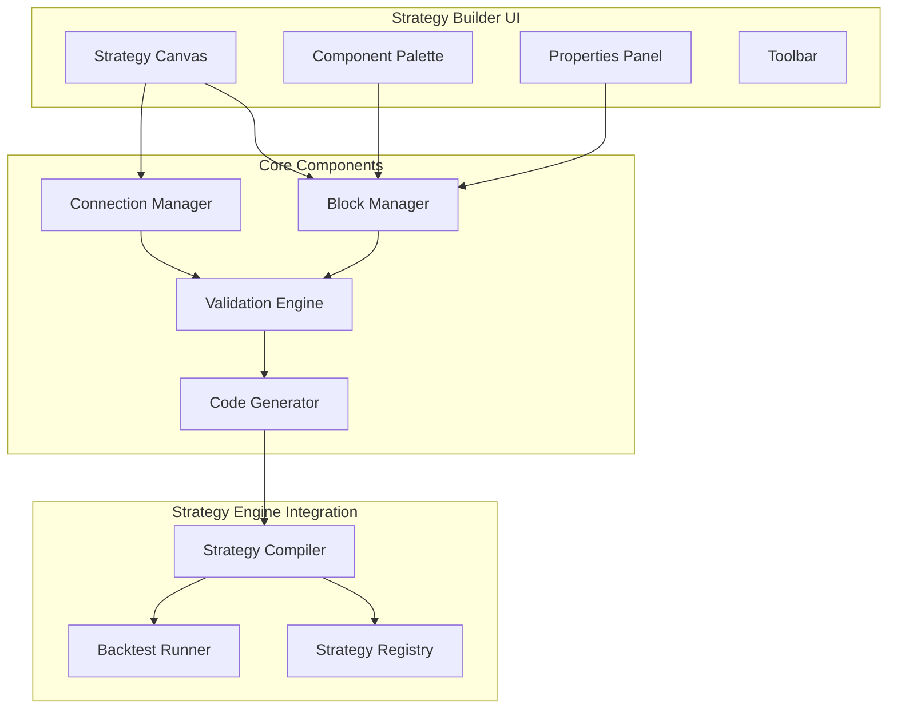
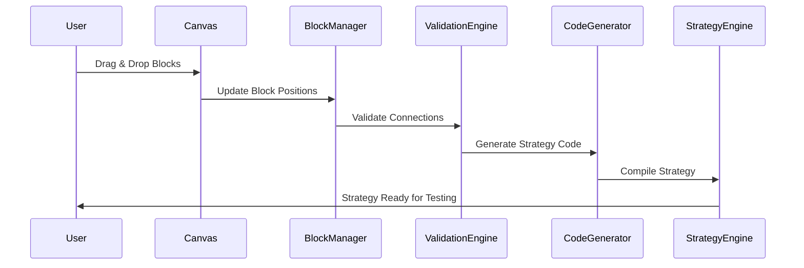
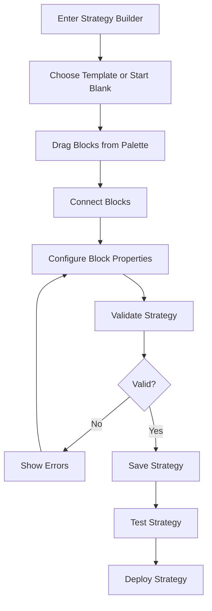
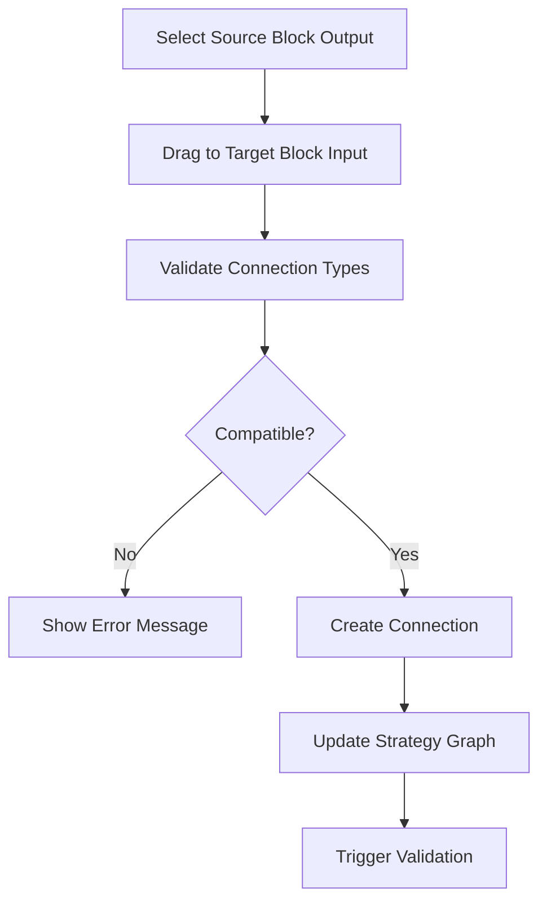

# Strategy Builder UI

## Overview

The Strategy Builder UI is a visual, drag-and-drop interface that allows users to create custom trading strategies without writing code. It provides a block-based approach similar to Scratch or Node-RED, where traders can visually connect indicators, conditions, and actions to build sophisticated trading algorithms.

## Purpose

- **Democratize Strategy Creation**: Allow non-programmers to create advanced trading strategies
- **Rapid Prototyping**: Enable quick strategy development and testing
- **Visual Logic**: Make complex trading logic understandable through visual representation
- **Strategy Marketplace**: Enable community sharing of visually built strategies
- **Educational Tool**: Help users understand trading strategy components and flow

## Core Features

### 1. Visual Strategy Editor
- **Drag & Drop Interface**: Block-based strategy construction
- **Canvas Workspace**: Large workspace for complex strategies
- **Component Library**: Pre-built blocks for indicators, conditions, actions
- **Connection System**: Visual connections between blocks showing data flow
- **Validation**: Real-time validation of strategy logic and connections

### 2. Strategy Components

#### Input Blocks
- **Market Data**: Price, volume, candlestick data
- **Technical Indicators**: EMA, SMA, MACD, RSI, Bollinger Bands, etc.
- **Custom Parameters**: User-configurable values
- **Time Conditions**: Time-based triggers and filters

#### Logic Blocks
- **Comparison Operations**: Greater than, less than, equals, crosses above/below
- **Logical Operations**: AND, OR, NOT operations
- **Mathematical Operations**: Addition, subtraction, multiplication, division
- **Conditional Logic**: IF-THEN-ELSE structures

#### Action Blocks
- **Trade Actions**: Buy, sell, close position
- **Order Types**: Market order, limit order, stop order
- **Risk Management**: Stop loss, take profit, position sizing
- **Notifications**: Alerts, webhooks, email notifications

#### Output Blocks
- **Signal Generation**: Buy/sell signals
- **Data Export**: Export signals or indicator values
- **Logging**: Debug and monitoring outputs

### 3. Strategy Management
- **Save/Load**: Persistent strategy storage
- **Versioning**: Track strategy changes and versions
- **Templates**: Pre-built strategy templates
- **Sharing**: Export/import strategies within community
- **Categories**: Organize strategies by type or market

### 4. Testing & Validation
- **Syntax Validation**: Ensure strategy logic is complete and valid
- **Backtest Integration**: One-click backtesting of visual strategies
- **Parameter Optimization**: Visual parameter tuning interface
- **Performance Preview**: Real-time performance indicators

## Architecture Design

### Frontend Architecture



### Data Flow



## Module Responsibilities

### 1. Strategy Builder Core (`/src/features/strategy-builder/`)

#### Components
- **StrategyCanvas**: Main workspace for building strategies
- **ComponentPalette**: Library of available blocks
- **BlockRenderer**: Individual block visualization and interaction
- **ConnectionRenderer**: Visual connections between blocks
- **PropertiesPanel**: Block configuration interface

#### Services
- **BlockService**: Manage block lifecycle and properties
- **ConnectionService**: Handle block connections and validation
- **StrategyBuilderService**: Coordinate strategy building operations
- **CodeGenerationService**: Convert visual strategy to executable code

#### Types
- **BlockType**: Definition of block types and categories
- **ConnectionType**: Connection validation rules
- **StrategyDefinition**: Complete strategy representation

### 2. Block System (`/src/features/strategy-builder/blocks/`)

#### Block Categories
- **IndicatorBlocks**: Technical indicator implementations
- **LogicBlocks**: Comparison and logical operations
- **ActionBlocks**: Trading actions and orders
- **InputBlocks**: Data sources and parameters

### 3. Code Generation (`/src/features/strategy-builder/compiler/`)

#### Components
- **StrategyCompiler**: Convert visual blocks to executable strategy
- **ValidationRules**: Ensure strategy completeness and validity
- **TypeChecker**: Validate data type compatibility
- **OptimizationEngine**: Optimize generated strategy code

## Database Schema Changes

### New Tables

#### 1. visual_strategies
```sql
CREATE TABLE visual_strategies (
    id INT AUTO_INCREMENT PRIMARY KEY,
    name VARCHAR(255) NOT NULL,
    description TEXT,
    user_id INT NOT NULL,
    strategy_definition JSON NOT NULL,
    compiled_strategy JSON,
    version INT DEFAULT 1,
    is_active BOOLEAN DEFAULT FALSE,
    is_public BOOLEAN DEFAULT FALSE,
    created_at TIMESTAMP DEFAULT CURRENT_TIMESTAMP,
    updated_at TIMESTAMP DEFAULT CURRENT_TIMESTAMP ON UPDATE CURRENT_TIMESTAMP,
    INDEX idx_user_id (user_id),
    INDEX idx_active (is_active),
    INDEX idx_public (is_public)
);
```

#### 2. strategy_blocks
```sql
CREATE TABLE strategy_blocks (
    id INT AUTO_INCREMENT PRIMARY KEY,
    block_type VARCHAR(100) NOT NULL,
    category VARCHAR(50) NOT NULL,
    name VARCHAR(255) NOT NULL,
    description TEXT,
    input_schema JSON,
    output_schema JSON,
    properties_schema JSON,
    implementation_code TEXT,
    is_system BOOLEAN DEFAULT TRUE,
    user_id INT,
    created_at TIMESTAMP DEFAULT CURRENT_TIMESTAMP,
    INDEX idx_category (category),
    INDEX idx_type (block_type),
    INDEX idx_user (user_id)
);
```

#### 3. strategy_templates
```sql
CREATE TABLE strategy_templates (
    id INT AUTO_INCREMENT PRIMARY KEY,
    name VARCHAR(255) NOT NULL,
    description TEXT,
    category VARCHAR(100),
    strategy_definition JSON NOT NULL,
    preview_image VARCHAR(500),
    difficulty_level ENUM('BEGINNER', 'INTERMEDIATE', 'ADVANCED') DEFAULT 'BEGINNER',
    tags JSON,
    download_count INT DEFAULT 0,
    rating DECIMAL(3,2) DEFAULT 0.00,
    created_by INT,
    created_at TIMESTAMP DEFAULT CURRENT_TIMESTAMP,
    INDEX idx_category (category),
    INDEX idx_difficulty (difficulty_level),
    INDEX idx_rating (rating)
);
```

## Socket Events

### Client to Server Events

#### strategy-builder:save
```typescript
interface SaveStrategyEvent {
    strategyId?: string;
    name: string;
    description: string;
    strategyDefinition: StrategyDefinition;
    isPublic: boolean;
}
```

#### strategy-builder:validate
```typescript
interface ValidateStrategyEvent {
    strategyDefinition: StrategyDefinition;
}
```

#### strategy-builder:compile
```typescript
interface CompileStrategyEvent {
    strategyDefinition: StrategyDefinition;
}
```

#### strategy-builder:test
```typescript
interface TestStrategyEvent {
    strategyDefinition: StrategyDefinition;
    testParams: {
        symbol: string;
        timeframe: string;
        startDate: string;
        endDate: string;
    };
}
```

### Server to Client Events

#### strategy-builder:validation-result
```typescript
interface ValidationResultEvent {
    isValid: boolean;
    errors: ValidationError[];
    warnings: ValidationWarning[];
}
```

#### strategy-builder:compilation-result
```typescript
interface CompilationResultEvent {
    success: boolean;
    compiledStrategy?: CompiledStrategy;
    error?: string;
}
```

#### strategy-builder:test-result
```typescript
interface TestResultEvent {
    success: boolean;
    results?: BacktestResults;
    error?: string;
}
```

## API Endpoints

### Strategy Management

#### GET /api/strategy-builder/strategies
```typescript
// Get user's visual strategies
Response: {
    strategies: VisualStrategy[];
    total: number;
}
```

#### POST /api/strategy-builder/strategies
```typescript
// Create new visual strategy
Request: {
    name: string;
    description: string;
    strategyDefinition: StrategyDefinition;
    isPublic: boolean;
}
Response: {
    strategyId: string;
    success: boolean;
}
```

#### PUT /api/strategy-builder/strategies/:id
```typescript
// Update visual strategy
Request: {
    name?: string;
    description?: string;
    strategyDefinition?: StrategyDefinition;
    isPublic?: boolean;
}
Response: {
    success: boolean;
}
```

#### DELETE /api/strategy-builder/strategies/:id
```typescript
// Delete visual strategy
Response: {
    success: boolean;
}
```

### Block Management

#### GET /api/strategy-builder/blocks
```typescript
// Get available blocks
Response: {
    blocks: StrategyBlock[];
    categories: string[];
}
```

#### POST /api/strategy-builder/blocks
```typescript
// Create custom block (premium feature)
Request: {
    blockType: string;
    name: string;
    description: string;
    inputSchema: object;
    outputSchema: object;
    implementationCode: string;
}
Response: {
    blockId: string;
    success: boolean;
}
```

### Template Management

#### GET /api/strategy-builder/templates
```typescript
// Get strategy templates
Query: {
    category?: string;
    difficulty?: string;
    limit?: number;
    offset?: number;
}
Response: {
    templates: StrategyTemplate[];
    total: number;
}
```

#### GET /api/strategy-builder/templates/:id
```typescript
// Get specific template
Response: {
    template: StrategyTemplate;
}
```

### Compilation & Testing

#### POST /api/strategy-builder/compile
```typescript
// Compile visual strategy to executable code
Request: {
    strategyDefinition: StrategyDefinition;
}
Response: {
    success: boolean;
    compiledStrategy?: CompiledStrategy;
    error?: string;
}
```

#### POST /api/strategy-builder/validate
```typescript
// Validate strategy definition
Request: {
    strategyDefinition: StrategyDefinition;
}
Response: {
    isValid: boolean;
    errors: ValidationError[];
    warnings: ValidationWarning[];
}
```

#### POST /api/strategy-builder/backtest
```typescript
// Run backtest on visual strategy
Request: {
    strategyDefinition: StrategyDefinition;
    symbol: string;
    timeframe: string;
    startDate: string;
    endDate: string;
}
Response: {
    success: boolean;
    results?: BacktestResults;
    error?: string;
}
```

## Folder Structure

```
src/
├── features/
│   └── strategy-builder/
│       ├── components/
│       │   ├── StrategyCanvas.tsx
│       │   ├── ComponentPalette.tsx
│       │   ├── BlockRenderer.tsx
│       │   ├── ConnectionRenderer.tsx
│       │   ├── PropertiesPanel.tsx
│       │   ├── StrategyToolbar.tsx
│       │   └── ValidationPanel.tsx
│       ├── blocks/
│       │   ├── IndicatorBlocks/
│       │   │   ├── EMABlock.tsx
│       │   │   ├── MACDBlock.tsx
│       │   │   ├── RSIBlock.tsx
│       │   │   └── index.ts
│       │   ├── LogicBlocks/
│       │   │   ├── ComparisonBlock.tsx
│       │   │   ├── LogicalBlock.tsx
│       │   │   ├── ConditionalBlock.tsx
│       │   │   └── index.ts
│       │   ├── ActionBlocks/
│       │   │   ├── TradeBlock.tsx
│       │   │   ├── OrderBlock.tsx
│       │   │   ├── NotificationBlock.tsx
│       │   │   └── index.ts
│       │   ├── InputBlocks/
│       │   │   ├── MarketDataBlock.tsx
│       │   │   ├── ParameterBlock.tsx
│       │   │   ├── TimeBlock.tsx
│       │   │   └── index.ts
│       │   └── index.ts
│       ├── services/
│       │   ├── BlockService.ts
│       │   ├── ConnectionService.ts
│       │   ├── StrategyBuilderService.ts
│       │   ├── CodeGenerationService.ts
│       │   └── ValidationService.ts
│       ├── hooks/
│       │   ├── useStrategyBuilder.ts
│       │   ├── useBlockManager.ts
│       │   ├── useConnectionManager.ts
│       │   ├── useStrategyValidation.ts
│       │   └── useCodeGeneration.ts
│       ├── types/
│       │   ├── blocks.ts
│       │   ├── strategy.ts
│       │   ├── connections.ts
│       │   └── validation.ts
│       ├── api/
│       │   └── strategyBuilderApi.ts
│       └── index.tsx
├── backend/src/modules/
│   └── strategy-builder/
│       ├── controllers/
│       │   ├── StrategyBuilderController.ts
│       │   ├── BlockController.ts
│       │   └── TemplateController.ts
│       ├── services/
│       │   ├── StrategyBuilderService.ts
│       │   ├── BlockService.ts
│       │   ├── CompilerService.ts
│       │   ├── ValidationService.ts
│       │   └── TemplateService.ts
│       ├── repositories/
│       │   ├── VisualStrategyRepository.ts
│       │   ├── StrategyBlockRepository.ts
│       │   └── StrategyTemplateRepository.ts
│       ├── routes/
│       │   └── index.ts
│       ├── entities/
│       │   ├── VisualStrategy.ts
│       │   ├── StrategyBlock.ts
│       │   └── StrategyTemplate.ts
│       ├── interfaces/
│       │   ├── IStrategyBuilder.ts
│       │   ├── IBlockManager.ts
│       │   └── ICompiler.ts
│       └── types/
│           ├── strategy-definition.ts
│           ├── block-types.ts
│           └── validation-types.ts
```

## Integration Points

### 1. Strategy Engine Integration
- Compiled strategies integrate with existing strategy registry
- Visual strategies can be started/stopped like code-based strategies
- Same performance monitoring and risk management applies

### 2. Backtest Engine Integration
- Visual strategies can be backtested using existing backtest infrastructure
- Results displayed in same format as code-based strategies
- Performance comparison between visual and code strategies

### 3. Chart Integration
- Strategy logic highlighted on charts
- Block outputs can be visualized as chart overlays
- Real-time strategy execution visualization

### 4. Authentication & Authorization
- User-specific strategy access control
- Strategy sharing permissions
- Premium features for advanced blocks

## User Experience Flow

### 1. Strategy Creation Flow


### 2. Block Connection Flow


## Performance Considerations

### 1. Canvas Performance
- Virtual scrolling for large strategies
- Efficient re-rendering using React.memo
- WebGL rendering for complex connections
- Lazy loading of block implementations

### 2. Compilation Performance
- Incremental compilation for changes
- Caching of compiled strategies
- Background compilation workers
- Optimized code generation

### 3. Real-time Updates
- Debounced validation during editing
- Efficient WebSocket event handling
- Optimistic UI updates
- Connection pooling for multiple users

## Security Considerations

### 1. Code Generation Security
- Sandboxed strategy execution
- Input sanitization for all block properties
- Limited API access for compiled strategies
- Resource limits for strategy execution

### 2. Strategy Sharing Security
- Strategy content validation before sharing
- Malicious code detection
- User permission verification
- Rate limiting on strategy operations

### 3. Data Protection
- Encrypted storage of sensitive strategy parameters
- Audit logging of strategy changes
- Access control for sensitive market data
- Secure transmission of strategy definitions

## Testing Strategy

### 1. Unit Tests
- Block component testing
- Connection validation testing
- Code generation testing
- Service layer testing

### 2. Integration Tests
- Strategy compilation end-to-end
- Backtest integration testing
- Database operations testing
- API endpoint testing

### 3. UI Tests
- Canvas interaction testing
- Drag and drop functionality
- Block connection testing
- Strategy validation workflow

### 4. Performance Tests
- Large strategy handling
- Canvas rendering performance
- Compilation speed testing
- Concurrent user testing

## Future Enhancements

### Phase 1 Extensions
- **Advanced Blocks**: Machine learning indicators, sentiment analysis
- **Strategy Debugging**: Step-through debugging of visual strategies
- **Performance Profiling**: Visual strategy performance analysis
- **Multi-timeframe**: Support for multiple timeframe strategies

### Phase 2 Extensions
- **Collaborative Editing**: Multiple users editing same strategy
- **Version Control**: Advanced strategy versioning and branching
- **A/B Testing**: Compare multiple strategy variants
- **Mobile Support**: Touch-optimized strategy building

### Phase 3 Extensions
- **AI Assistant**: AI-powered strategy suggestions
- **Natural Language**: Convert text descriptions to visual strategies
- **Advanced Visualization**: 3D strategy visualization
- **Strategy Marketplace**: Commercial strategy sharing platform