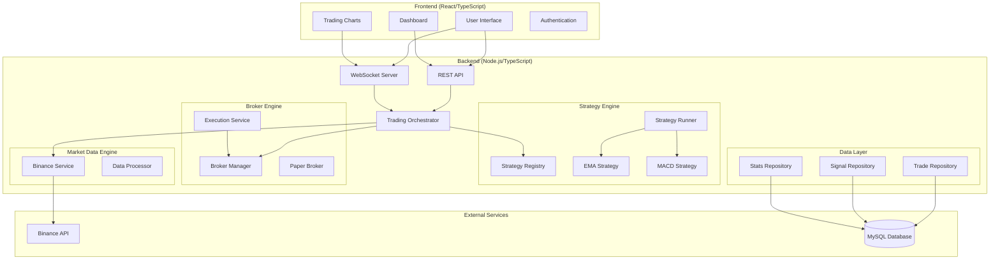

# System Architecture

## Overview

Trade EMA follows a modular, event-driven architecture designed for real-time cryptocurrency trading. The system is built using clean architecture principles with clear separation between business logic, data persistence, and presentation layers.

## High-Level Architecture



## Core Components

### 1. Trading Orchestrator

**Purpose**: Central coordinator for all trading activities

**Responsibilities**:
- Initialize all system components
- Coordinate data flow between engines
- Handle real-time market data
- Execute trading signals
- Broadcast updates to clients

**Key Methods**:
```typescript
class TradingOrchestrator {
  start(): void                    // Initialize system
  stop(): void                     // Shutdown system
  onPriceUpdate(candle: Candle)    // Process market data
  executeSignal(signal: Signal)    // Execute trading signals
}
```

### 2. Strategy Engine

**Purpose**: Implement and execute trading strategies

**Components**:
- **Strategy Registry**: Manages available strategies
- **Strategy Runner**: Executes strategies on market data
- **Individual Strategies**: Implement specific trading logic

**Strategy Interface**:
```typescript
interface IStrategy {
  name: string
  description: string
  getIndicators(): Indicator[]
  onCandle(candle: Candle): Promise<Signal | null>
}
```

**Built-in Strategies**:

#### EMA Strategy
- Uses EMA 5, 26, and 150 for trend analysis
- Calculates price angle for momentum
- Generates signals on alignment conditions

#### MACD Strategy
- Implements MACD oscillator analysis
- Uses signal line crossovers
- Considers histogram divergence

### 3. Market Data Engine

**Purpose**: Handle real-time market data from external sources

**Components**:
- **Binance Service**: WebSocket connection to Binance
- **Data Processor**: Aggregates and validates market data
- **Indicator Service**: Calculates technical indicators

**Data Flow**:
1. Connect to Binance WebSocket
2. Receive real-time price ticks
3. Aggregate into candlestick data
4. Calculate technical indicators
5. Broadcast to strategy engine

### 4. Broker Engine

**Purpose**: Execute trades and manage orders

**Components**:
- **Broker Manager**: Manages broker connections
- **Paper Broker**: Simulated trading for testing
- **Execution Service**: Handles order execution
- **Real Broker**: Live trading implementation (extensible)

**Trading Flow**:
1. Receive signal from strategy
2. Validate signal parameters
3. Calculate position size
4. Execute trade through broker
5. Monitor stop-loss and take-profit
6. Close positions when triggered

### 5. Data Persistence Layer

**Purpose**: Store and retrieve trading data

**Repositories**:
- **Trade Repository**: Trade history and positions
- **Signal Repository**: Generated trading signals
- **Stats Repository**: Performance metrics

**Database Schema**: See [Database Design](./database-design.md)

## Communication Patterns

### Real-time Updates (WebSocket)

```typescript
// Client Events
socket.on('price_update', (candle: Candle) => {...})
socket.on('signal', (signal: Signal) => {...})
socket.on('trade_open', (trade: Trade) => {...})
socket.on('trade_close', (trade: Trade) => {...})
socket.on('stats_update', (stats: Stats) => {...})
```

### API Communications (REST)

```typescript
// Authentication
POST /api/auth/login
POST /api/auth/register

// Trading Data
GET /api/trades
GET /api/signals
GET /api/stats

// Strategy Management
GET /api/strategies
POST /api/strategies/start
POST /api/strategies/stop

// Market Data
GET /api/market/candles
GET /api/market/current
```

## Data Flow Architecture

### 1. Market Data Flow

```
Binance API → Binance Service → Trading Orchestrator → Strategy Engine
                                                     ↓
Frontend ← WebSocket ← Socket Service ← Trading Orchestrator
```

### 2. Signal Generation Flow

```
Market Data → Strategy → Signal → Execution Service → Broker Engine
                                                    ↓
                     Database ← Repository ← Trade Created
```

### 3. Real-time Updates Flow

```
Database Event → Repository → Service → Socket Service → Frontend
```

## Scalability Considerations

### 1. Horizontal Scaling
- Stateless API design
- Database connection pooling
- Redis for session management (future)
- Load balancer support

### 2. Performance Optimization
- Efficient market data processing
- Optimized database queries
- Connection pooling
- Caching strategies

### 3. Fault Tolerance
- Error handling at all levels
- Graceful degradation
- Automatic reconnection
- Comprehensive logging

## Security Architecture

### 1. Authentication & Authorization
- JWT-based authentication
- Role-based access control
- Secure password hashing (bcrypt)
- Session management

### 2. API Security
- CORS configuration
- Input validation
- SQL injection prevention
- Rate limiting (future)

### 3. Data Protection
- Environment variable configuration
- Secure secret management
- Encrypted database connections

## Configuration Management

### Environment Variables
```env
# Database
DB_HOST=localhost
DB_USER=root
DB_PASSWORD=password
DB_NAME=trade_ema

# Server
PORT=3000
CORS_ORIGIN=http://localhost:5173

# Authentication
JWT_SECRET=secure_secret

# Trading
SIMULATION_ENABLED=true
SIMULATION_INTERVAL=1000
```

### Configuration Service
```typescript
export const config = {
  port: process.env.PORT || 3000,
  db: {...},
  cors: {...},
  simulation: {...},
  jwtSecret: process.env.JWT_SECRET
}
```

## Error Handling Strategy

### 1. Error Types
- **Validation Errors**: Input validation failures
- **Network Errors**: External API failures
- **Database Errors**: Connection and query failures
- **Business Logic Errors**: Strategy execution errors

### 2. Error Handling Patterns
- Try-catch blocks with specific error types
- Centralized error logging
- Graceful fallback mechanisms
- User-friendly error messages

### 3. Monitoring & Logging
- Structured logging with timestamps
- Error tracking and alerting
- Performance monitoring
- Health check endpoints

## Technology Decisions

### Backend Framework: Express.js
- **Pros**: Lightweight, flexible, large ecosystem
- **Cons**: Minimal structure, requires additional setup
- **Rationale**: Quick setup, extensive middleware support

### Database: MySQL
- **Pros**: ACID compliance, mature, good performance
- **Cons**: Less flexible schema changes
- **Rationale**: Strong consistency for financial data

### Real-time Communication: Socket.IO
- **Pros**: Easy WebSocket management, fallback support
- **Cons**: Additional overhead
- **Rationale**: Reliable real-time updates for trading

### Frontend: React with TypeScript
- **Pros**: Component-based, strong typing, large community
- **Cons**: Learning curve, build complexity
- **Rationale**: Modern development experience, type safety

### State Management: TanStack Query
- **Pros**: Server state management, caching, optimistic updates
- **Cons**: Additional dependency
- **Rationale**: Excellent for API data management

## Future Architecture Considerations

### 1. Microservices Migration
- Split into domain-specific services
- Event-driven architecture
- Container orchestration (Docker/Kubernetes)

### 2. Enhanced Real-time Processing
- Message queue integration (Redis/RabbitMQ)
- Stream processing (Apache Kafka)
- CQRS pattern implementation

### 3. Advanced Analytics
- Time-series database (InfluxDB)
- Machine learning integration
- Advanced backtesting framework

### 4. Multi-Exchange Support
- Exchange adapter pattern
- Unified order management
- Cross-exchange arbitrage